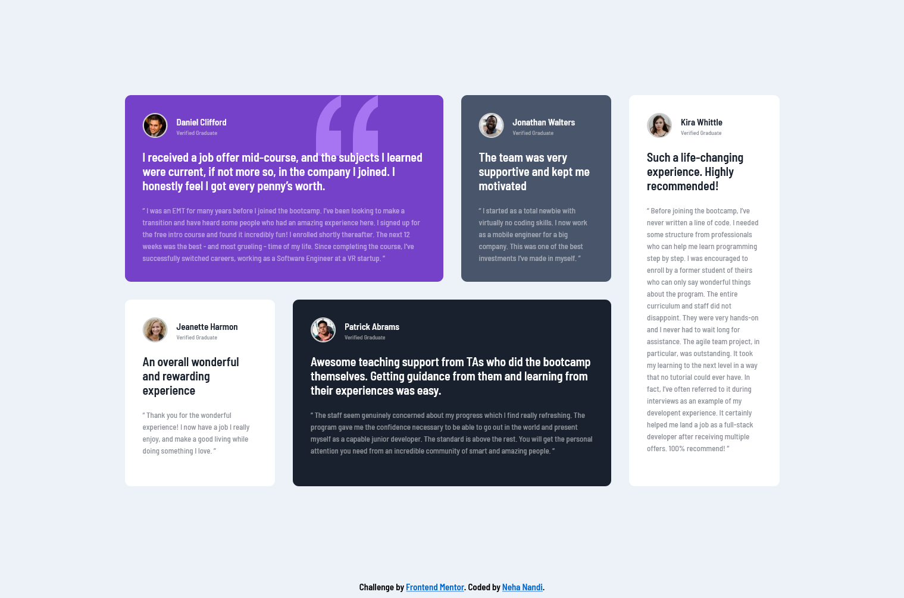

# Frontend Mentor - Testimonials grid section solution

This is a solution to the [Testimonials grid section challenge on Frontend Mentor](https://www.frontendmentor.io/challenges/testimonials-grid-section-Nnw6J7Un7). Frontend Mentor challenges help you improve your coding skills by building realistic projects.

## Table of contents

- [Overview](#overview)
  - [The challenge](#the-challenge)
  - [Screenshot](#screenshot)
  - [Links](#links)
- [My process](#my-process)
  - [Built with](#built-with)
  - [What I learned](#what-i-learned)
  - [Continued development](#continued-development)
- [Author](#author)

## Overview

Solution for the frontendmentor.io Testimonials Grid Section menu solved using HTML, CSS, SCSS, and Grid.

### The challenge

Users should be able to:

- View the optimal layout for the site depending on their device's screen size

### Screenshot

Desktop - 

Mobile: 

### Links

- Solution URL: [https://github.com/nehanandi09/testimonials-grid-section](https://github.com/nehanandi09/testimonials-grid-section)
- Live Site URL: [https://nehanandi09.github.io/testimonials-grid-section/](https://nehanandi09.github.io/testimonials-grid-section/)

## My process

### Built with

- Semantic HTML5 markup
- CSS custom properties
- Sass/Scss
- Flexbox
- CSS Grid

### What I learned

Learnt how to use CSS Grids, and how to make it responsive for different screens.

### Continued development

Learn CSS Grids without using media queries

## Author

- Github - [@nehanandi09](https://github.com/nehanandi09)
- Frontend Mentor - [@nehanandi09](https://www.frontendmentor.io/profile/nehanandi09)
